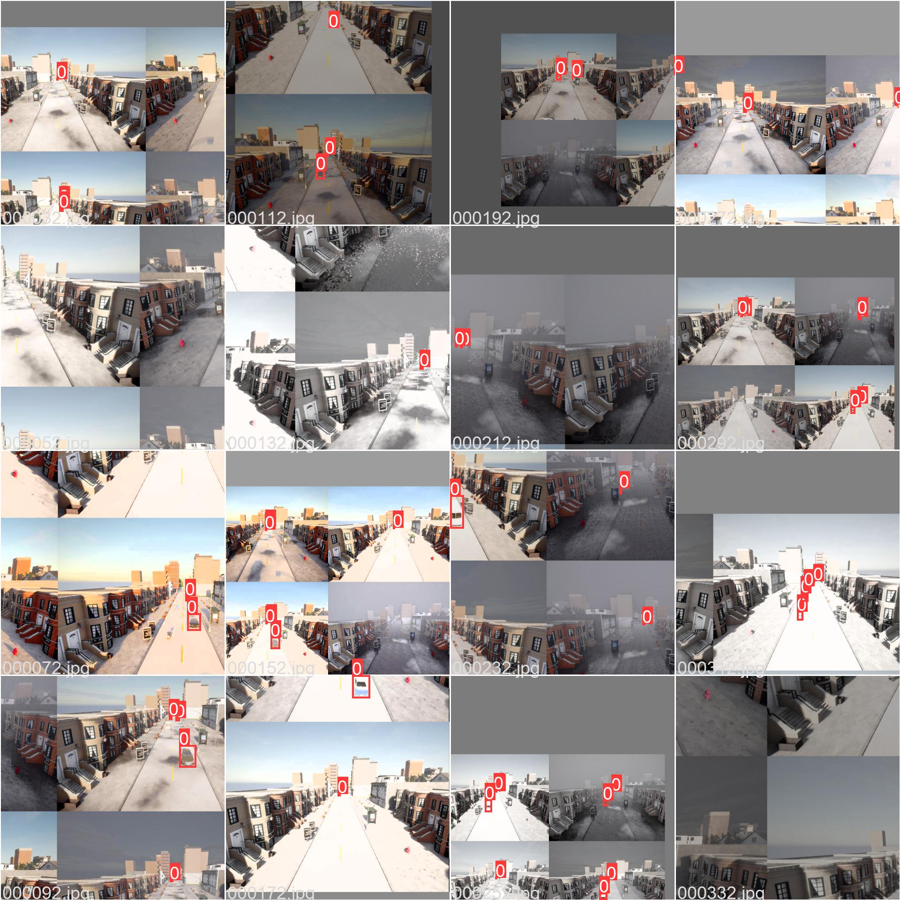

# Carla-Roadside-Dataset-Generator
This repository aims to build an open-source package based on [Carla](https://carla.org/) to generate a roadside dataset with different sensing modalities.




## Table of Contents
- [Carla-Roadside-Dataset-Generator](#Carla-Roadside-Dataset-Generator)
- [Update](#update)
- [Credit](#credit)
- [Dependencies](#dependencies)
- [Modules](#modules)
- [Demo](#demo)
- [Notes](#notes)

## Update
Nov 2 2021 - a demo dataset which containes 14k images in COCO form can be downloaded [here](https://drive.google.com/file/d/1GH1iNbmMFFKhFslynpXsFe9sIMqII-XK/view?usp=sharing).

## Credit
I want to say thanks to the developers of [Carla](https://carla.org/) and [Carla-2DBBOX](https://github.com/MukhlasAdib/CARLA-2DBBox). This package cannot be developed so fast without the help from the open-source community. I want to also express thanks to the developers of [YOLO V5](https://github.com/ultralytics/yolov5) for making it so easy to train on a custom dataset and strong performance.

## Dependencies
This package is depended on Carla as the dataset generator. We also used YOLO V5 to do a demo training and see if the data works. We list the dependencies version we use and official installation guide in the following.
* [Carla 0.9.12](https://github.com/carla-simulator/carla/releases/tag/0.9.12)
* [PyTorch 1.8.2 LTS](https://pytorch.org/get-started/locally/)
* [YOLO V5](https://github.com/ultralytics/yolov5) (You may not need this because we include it in our repo)

## Modules
There is a class named `dataset_generator`. Now it has the basic function which can generate data in different lightning and weather conditions based on input world, sensor location, number of frames etc. More functions are expected to add in future.

### How to Use
You may change the global variables in the `test_dataset_generator.py`. Their usage is decribed in the comments.

## Demo
Running the demo is quite easy. The steps are shown below.
```
$ conda activate $your_carla_venv
$ python test_dataset_generator.py
```
After the dateset is generated, you should be able to see the dataset under the `./data` folder. Now we can run the YOLO training. You can download a pre-trained weight from [YOLO](https://github.com/ultralytics/yolov5). In our case, we use the medium weight and train with the following command on our hardware (RTX 3090).
```
$ python train.py --img 800 --batch 36 --epochs 300 --data ../carla_dataset.yaml --weights yolov5m.pt
```

## Notes
There are something to notice.
* We assume one-class problem i.e., there is only a vehicle class. Future work can be extended.
* The work can also be extended to multi-view, multi-map etc.
* The demo is quite simple (single class, single view), so we achive high mAP results. We trained on the demo dataset and got 0.75 mAP[0.5:0.95] and it converges after 85 epochs.
